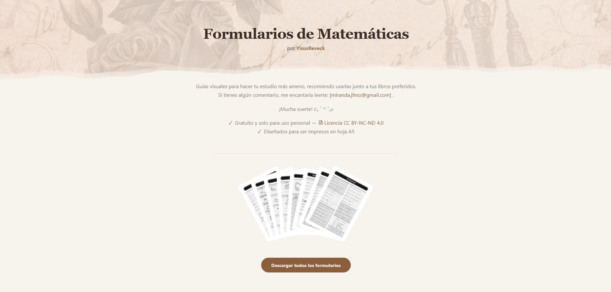

# MathForms

Sitio web con formularios de matemáticas gratuitos para estudiar, organizados por distintas ramas de las matemáticas y diseñados en formato A5, listos para descargar e imprimir. ^^
**Demo:** [Ver sitio](https://yisusreveck.github.io/mathforms/)

## Capturas



## Tecnologías

- Angular
- Inkscape

## Características

- Modo claro/oscuro
- Diseño responsive

## Instalación local

```bash
npm install
ng serve
```

## Licencia

- **Código:** MIT — ver [LICENSE](LICENSE).
- **Formularios (PDFs e imágenes en `/public/math_forms`):** CC BY-NC-ND 4.0 — ver [texto completo](https://creativecommons.org/licenses/by-nc-nd/4.0/legalcode).

## Autor

Jesús Miranda | YisusReveck — [LinkedIn](https://www.linkedin.com/in/jesusm147/) · [GitHub](https://github.com/YisusReveck)
